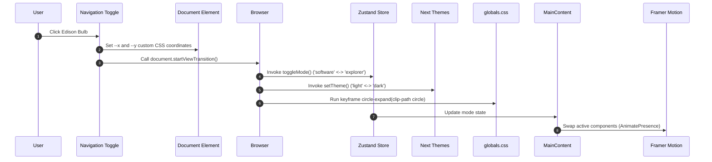

# ⚡ Yaswanth Sai Sandeep Kalagatla: The 2026 Architectural Manifest

[](https://saisandeepkalagatala.vercel.app/)
[](https://github.com/Sandeep010-hub/Portfolio)

This repository houses a high-frequency, dual-identity portfolio web application. Engineered to transcend traditional static resumes, it operates as a **dynamic identity engine** that adapts its entire structural, visual, typographic, and content layers depending on the active persona.

---

## 🌪 The Dual-Identity Engine

At the core of this system is a coordinate-aware **Handshake Protocol** that toggles the global application state between two personas:

### 1. 🏗 Software Architect Mode
Designed for engineering leads, technical recruiters, and system designers.
* **Visual Language**: High-contrast, dark-mode terminal layout.
* **Typography**: Monospace/Sans-serif hybrid for precision.
* **Featured Components**:
  * **System Core**: A Bento Grid of core runtime layers (`Next.js 16`, `FastAPI`, `AWS`, `Agentic RAG`).
  * **Git-Log Timeline**: Experience rendered as a simulated interactive terminal sequence (`git log --pretty=oneline`).
  * **Secure Handshake Contact**: Developer input fields validating inputs as secure payload packets.

### 2. 🔭 AEO Strategist Mode (Explorer)
Designed for founders, strategic partners, and AI thought leaders.
* **Visual Language**: Editorial elegance with warm stone and coffee tones.
* **Typography**: High-end serif/italic styling.
* **Featured Components**:
  * **AEO Chapter Archive**: 10-chapter architectural guide on transitioning search paradigms for LLM search engines.
  * **LinkedIn Insights Feed**: Rendered glassmorphic cards showing curated essays on production DevOps.

---

## 📂 Codebase Directory Layout

The component tree follows a clean, three-layer modular organization:

```
D:\Portfolio/
├── app/
│   ├── globals.css          # CSS View Transition keyframes & Tailwind layers
│   ├── layout.tsx           # Global Providers & static metadata config
│   ├── loading.tsx          # Router fallback suspenses
│   └── page.tsx             # Root page rendering layout sections
├── components/
│   ├── layout/              # Nav wrappers, footer, theme handlers, and SEO injects
│   │   ├── ClientSEO.tsx
│   │   ├── Footer.tsx
│   │   ├── MainContent.tsx
│   │   ├── Navigation.tsx
│   │   └── ThemeProvider.tsx
│   ├── sections/            # Mode-aware landing page page elements
│   │   ├── ContactSection.tsx
│   │   ├── HeroSection.tsx
│   │   ├── LinkedInInsights.tsx
│   │   ├── ProjectShowcase.tsx
│   │   ├── ResearchExplorer.tsx
│   │   ├── TechStackSection.tsx
│   │   └── TimelineSection.tsx
│   └── ui/                  # Atomic UI utility elements
│       └── ProjectCard.tsx
├── data/                    # Strictly-typed static models and mocks
│   ├── projects.ts
│   ├── techstack.ts
│   └── timeline.ts
├── store/                   # Global Zustand state stores
│   └── useProfileStore.ts
├── public/                  # Optimized portraits and static screenshots
├── package.json             # Runtime dependencies
└── tsconfig.json            # Path alias configurations (@/*)
```

---

## ⚡ Technical Specification & State Orchestration



### 1. State Control (Zustand)
Global state is managed by a lightweight, reactive Zustand store in [`store/useProfileStore.ts`](file:///D:/Portfolio/store/useProfileStore.ts), tracking `mode` (`'software' | 'explorer'`).

### 2. The Circular Ripple Transition
Mode transitions are visual-first, utilizing the native **View Transitions API**:
* Custom click coordinates (`e.clientX`, `e.clientY`) are captured in [`Navigation.tsx`](file:///D:/Portfolio/components/layout/Navigation.tsx) and written into CSS variables on the root document element.
* [`globals.css`](file:///D:/Portfolio/app/globals.css) clips the old screenshot using a expanding radial path starting at `--x`/`--y` coordinates up to `150vw`.

### 3. Clientside SEO & Metadata Injection
To keep the site compliant with Answer Engine Optimization (AEO) frameworks, [`ClientSEO.tsx`](file:///D:/Portfolio/components/layout/ClientSEO.tsx):
* Dynamically rewrites the browser tab icon SVG markup when switching personas.
* Injects active JSON-LD Schema structures (`SoftwareApplication` for Software mode, `CreativeWork` for Explorer mode) into the `<head>` of the active page.

---

## 🚀 Protocol for Local Initialization

Follow these steps to spin up the portfolio locally:

```bash
# 01. Clone the repository
git clone https://github.com/Sandeep010-hub/Portfolio.git

# 02. Enter the root directory
cd Portfolio

# 03. Install dependencies using compatible legacy peer resolution
npm install --legacy-peer-deps

# 04. Boot the development server with Turbopack compilation
npm run dev

# 05. Build static HTML resources
npm run build
```

---

## 🛡️ Security & Performance Parameters

* **Zero-Secret Commit Policy**: Contact form routing in [`ContactSection.tsx`](file:///D:/Portfolio/components/sections/ContactSection.tsx) is simulated through client-side state hooks. All email transmissions are decoupled from static repository commits.
* **Lighthouse Targets**: Structured semantic hierarchy maintains >95 scores across accessibility and SEO audits.
* **Next.js Compilation**: Fast static rendering is compiled via Next.js Turbopack with 0 warnings or type-check anomalies.

---

**© 2026 Yaswanth Sai Sandeep Kalagatla.**  
*Architecting the future of Answer Engine discovery and high-precision software systems.*
